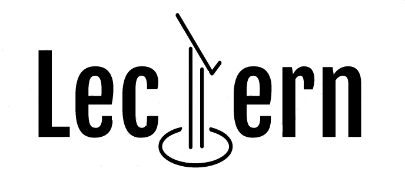
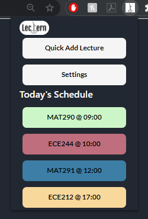
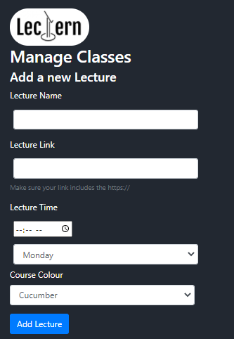
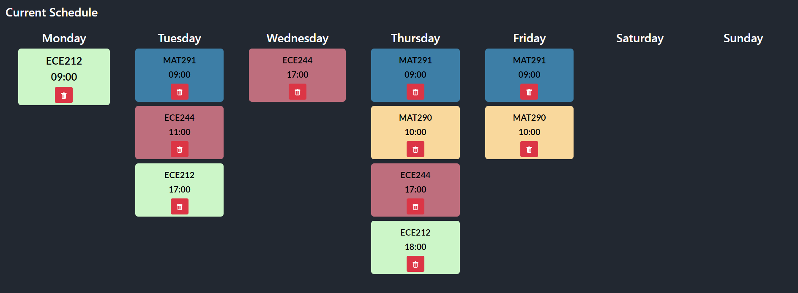

# Lectern - Manage your Online Lectures
### NewHacks 2020
#### Chrome Extension, JavaScript, HTML, CSS

**Our project concentrates on the simplification of organization of online lecture for students. We designed a Chrome extension called Lectern that notifies students of upcoming classes and offers instant class access as it begins. The extension is customizable, allowing students to input as many lectures and tutorials as they desire. Students input class names, times and a link to where the class is held. Clicking on the extension icon shows the student all classes they have during the day and offers the ability access their online lecture quickly as clicking the lecture will go to the saved lecture link. Clicking on the settings icon in the popup menu will allow the student to see their full schedule of inputted classes and the ability to add or remove classes as needed. The extension is designed with students in mind but can easily be used by professionals who have regularly weekly meetings or events.**

Screenshots
---

  
  
  

Challenges and Learnings
---
One of the challenges our team faced was some of us were not experienced with using JavaScript, HTML, and CSS. Since some of us were more experience with these languages, we worked with each other in pairs so that we were able help each other work on the project both gaining experience teach/learning more about these languages. Another challenge was it was all our first time creating a Chrome Extension. We weren't familiar with the APIs and the framework of building a extension, to overcome this, we had to do a lot of reading especially in the documentation to figure out different functions to implement features like storage and notifications. Working with times/dates was also a challenge for us as we had to calculate time and schedule the alarms for the notifications to go off. It proved to be quite difficult as we needed to figure out different situations and edge cases. Lastly we didn't have much experience with collaborative programming through Github which means we had to figure out how the system works. We also ran into some problems with merging and pulling each other's changes to which we had to circumvent with re-cloning the repository.

We all learned a lot and gain experience with working with JavaScript, CSS, and HTML and gaining experience making our first Chrome Extension. For example, some of our memebers learned a lot of concepts for CSS and JavaScript since they had not experience beforehand. Since some of use had some experience with JavaScript, we did learn a lot about the framework and ecosystem of Chrome Extensions and overall how to develop one. We also learned a lot about collaborating with Github and how to push and pull our changes.

Areas of Improvements and Future Steps
---
We had more features and quality of life changes that would have made the project more well-rounded but due to the time constraints we had to reduce the scope of our project. One of the features we wanted to add was importing an .ics file(calendar file with events) and have it automatically add the lectures to the storage. Currently the lectures notifications repeat automatically every 7 days, we wanted to add a feature where you could select the time for a lecture to repeat, for example if a lecture was biweekly or even one time events. We also wanted to add more customization features for each lecture/event for example changing the time before lecture notification(currently 10 minutes before) and editing currently stored lectures.

How we came up with the idea and split up work
---
We came up with this idea after we saw classmates, and ourselves constantly losing track of where online lecture links were especially when different courses use different platforms(Zoom, BBCollaborate, and Google Meets). Having something like Lectern give students access to these lecture links without having to search for where they were posted and in addition giving students notifications for when these lecture starts. For splitting up the work, two of us were more familiar with JavaScript so we worked on a majority of the extension code. The other two worked mainly on the CSS and HTML of the project with a little bit of JavaScript as well. They also spearheaded the design of the project using Figma to create a mockup of the extension.
